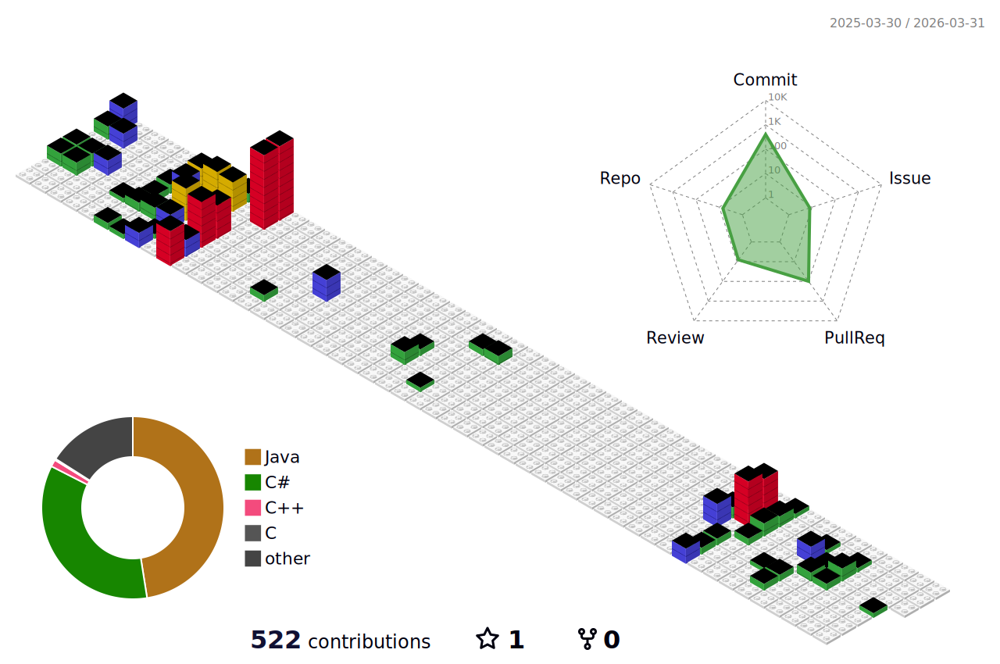

<h3 align="center">Hello, I'm Jaedong Hwang 👋</h3>
<h4 align="center">Software Engineering Student @ Sejong Univ., Seoul, Republic of Korea </h4>

 

  I am pursuing a <b>B.S. in Software Engineering</b>. 
  My studies focus on <b>Real-time Rendering</b> applications in 
  <b>Game Development</b> and <b>Virtual Production</b>.

  🌏 <b>Fluent in English</b> (Educated in Hong Kong under Canadian Curriculum)

  🚀 <b>Co-founder of </b>

 

  <b>🤖 Tech Stack (Click to Expand)</b>

 

 

 

 

 

  <b>🛠️ Tools (Click to Expand)</b>

 

<!-- I Like -->

 
<!-- terminal or CI -->

 
<!-- IDE and notepad -->

 

 

  <b>🔥 Now Studying & Focusing On</b>

 

  
  
  

  
    
  <i>"Developing High-End Graphics & Gameplay Mechanics"</i>

 

 

  

  <h3 align="center">OpenGL Projects 💻</h3>

<table width="100%" align = "center" style="border: none; border-collapse: collapse;">
  
  <tr>
    <td width="50%" valign="top" style="border: none; padding: 5px;">
      

        

          
<b>🦾 OpenGL Robot Arm</b>

           
          
            
          

            Implemented <b>Hierarchical Modeling</b> 
            & <b>Matrix Transformations</b> 
            using <b>C++ / OpenGL</b>.
          

        

      

    </td>
    <td width="50%" valign="top" style="border: none; padding: 5px;">
      

        

          
<b>🔮 GPU-Based Ray Tracer</b>

           
          
            
          

            Implemented <b>Ray-Sphere Intersection</b>, 
            <b>Shadows</b> & <b>Multiple Reflections</b> 
            in <b>GLSL Fragment Shader</b>.
          

        

      

    </td>
  </tr>
  <tr>
    <td width="50%" valign="top" style="border: none; padding: 5px;">
      

         
        

          
<b>🗿 OBJ Model Viewer</b>

           
          
            
          

            Developed <b>Custom OBJ Parser</b>. 
            Implemented <b>Phong Shading</b> with 
            Calculated <b>Vertex Normals</b>.
          

        

      

    </td>
    <td width="50%" valign="top" style="border: none; padding: 5px;">
      

         
        

          
<b>🌊 Interactive Waving Plane</b>

           
          
            
          

            Implemented <b>Vertex Manipulation</b> in GLSL 
            for <b>Sine Wave Animation</b>. 
            Applied <b>Height-Based Color Blending</b>.
          

        

      

    </td>
  </tr>

</table>

 

 

  

  <h3 align="center">OpenCV Projects 👁️</h3>

<table width="100%" style="border: none; border-collapse: collapse;">
  
  <tr>
    <td width="50%" valign="top" style="border: none; padding: 5px;">
      

        

          

            <b>⚡ Fastest Mean Filter (O(1))</b>
          

           
          
            
          

            Implemented <b>Summed-Area Table</b> 
            (Integral Image) to achieve <b>O(1)</b> 
            filtering speed regardless of kernel size.
          

        

      

    </td>
    <td width="50%" valign="top" style="border: none; padding: 5px;">
      

        

          

            <b>🌈 Auto Color Image Alignment</b>
          

           
          
            
          

            Reconstructed RGB images from 
            <b>Prokudin-Gorskii</b> glass plates using 
            <b>Channel Correlation</b> & <b>Search Optimization</b>.
          

        

      

    </td>
  </tr>
  <tr>
    <td colspan="2" style="border: none; padding: 5px;">
      

         
        

          

            <b>🎨 Painterly Rendering (NPR)</b>
          

           
          
            
          

            Implemented <b>Hertzmann’s Algorithm</b>. 
            Generated <b>Spline Strokes</b> based on 
            <b>Image Gradients</b> & Multi-layer Grid.
          

        

      

    </td>
  </tr>

</table>

 

<h3 align="center">📊 GitHub Analytics</h3>

  
    
  
  
  

  

 

<h3 align="center">Contact & Channels 📫</h3>

<b>Personal</b>

 

  

<b>Company</b>

 

 

