

  <picture>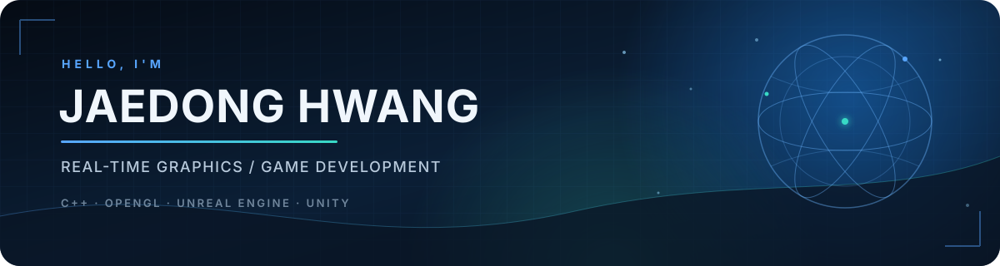</picture>

  <picture></picture>

 

  <picture>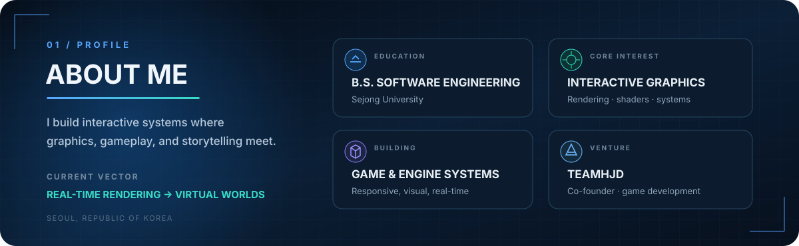</picture>

 

  <picture>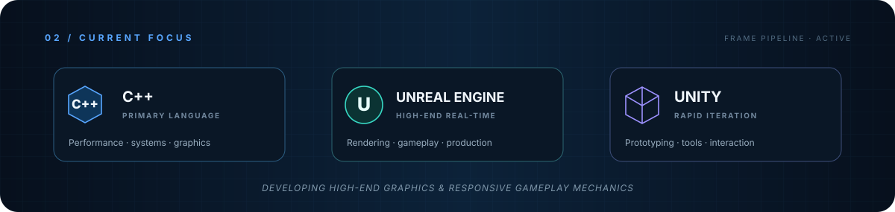</picture>

 

  <picture>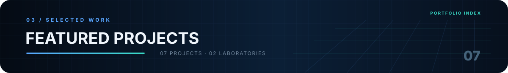</picture>

 

<a href="https://github.com/hjd5031/sju-computer-graphics">
  <picture>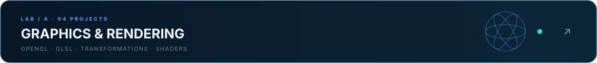</picture>
</a>

 

<table>
  <tr>
    <td width="50%" align="center" valign="top">
      <a href="https://github.com/hjd5031/sju-computer-graphics/tree/main/Robot_Arm_CTM_n_IK"><picture></picture></a>
       
      
        
      Hierarchical modeling and matrix transformations built from scratch with <b>C++ / OpenGL</b>.
        
    </td>
    <td width="50%" align="center" valign="top">
      <a href="https://github.com/hjd5031/sju-computer-graphics/tree/main/GPU-Based_Raytracer"><picture></picture></a>
       
      
        
      Ray-sphere intersections, shadows, and recursive-style reflections in a <b>GLSL fragment shader</b>.
        
    </td>
  </tr>
  <tr>
    <td width="50%" align="center" valign="top">
      <a href="https://github.com/hjd5031/sju-computer-graphics/tree/main/A_OBJ_Renderer"><picture></picture></a>
       
      
        
      A custom OBJ parser with calculated vertex normals and <b>Phong shading</b>.
        
    </td>
    <td width="50%" align="center" valign="top">
      <a href="https://github.com/hjd5031/sju-computer-graphics/tree/main/A_Waving_Plane"><picture></picture></a>
       
      
        
      GLSL vertex manipulation for sine-wave animation with <b>height-based color blending</b>.
        
    </td>
  </tr>
</table>

 

<a href="https://github.com/hjd5031/sju-multi-media-programming">
  <picture>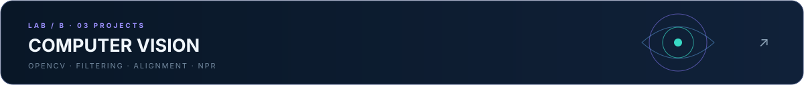</picture>
</a>

 

<table>
  <tr>
    <td width="50%" align="center" valign="top">
      <a href="https://github.com/hjd5031/sju-multi-media-programming/tree/main/MyCode/Assignment3"><picture></picture></a>
       
      
        
      A summed-area table enables <b>O(1)</b> filtering regardless of kernel size.
        
    </td>
    <td width="50%" align="center" valign="top">
      <a href="https://github.com/hjd5031/sju-multi-media-programming/tree/main/MyCode/Assignment2"><picture></picture></a>
       
      
        
      RGB reconstruction from Prokudin-Gorskii glass plates using <b>channel correlation</b> and optimized search.
        
    </td>
  </tr>
  <tr>
    <td colspan="2" align="center" valign="top">
      <a href="https://github.com/hjd5031/sju-multi-media-programming/tree/main/MyCode/Assignment4"><picture></picture></a>
       
      
        
      Hertzmann-inspired non-photorealistic rendering with gradient-guided spline strokes and a multi-layer grid.
        
    </td>
  </tr>
</table>

 

  <picture>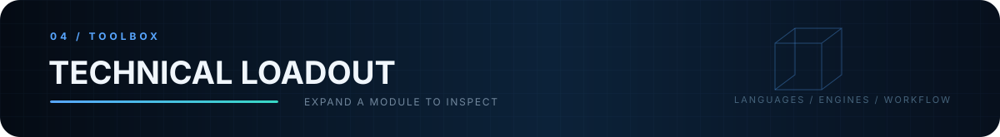</picture>

  
<b>04.A / Languages &amp; Graphics</b> · click to expand

   
  

    <picture>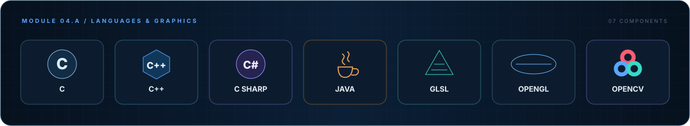</picture>
  

 

  
<b>04.B / Engines &amp; Workflow</b> · click to expand

   
  

    <picture>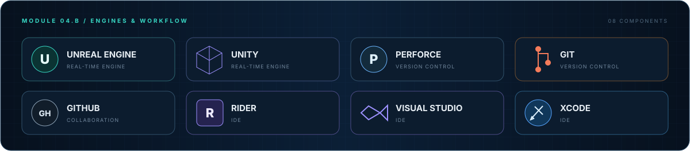</picture>
  

  

  <picture>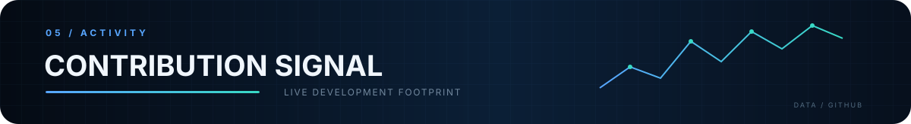</picture>

  <picture>
    <source media="(prefers-color-scheme: dark)" srcset="./profile-3d-contrib/profile-night-rainbow.svg" />
    <source media="(prefers-color-scheme: light)" srcset="./profile-3d-contrib/profile-gitblock.svg" />
    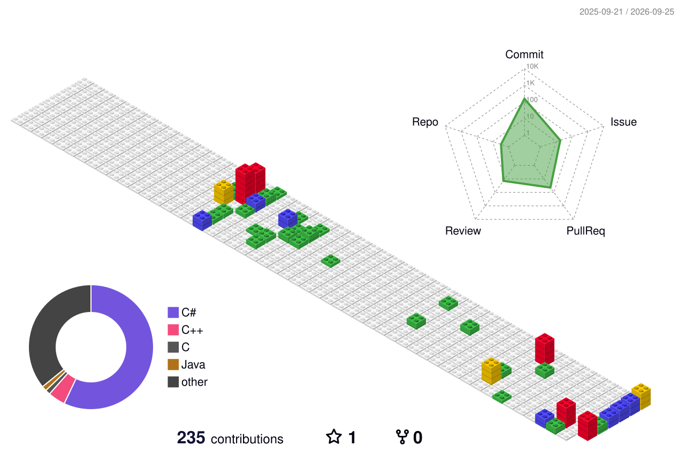
  </picture>

  

  <picture></picture>

  <picture></picture>
    
  
  
  
  
  

     

  <picture></picture>
    
  
    
  
  
  

  

  <picture>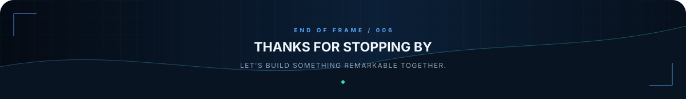</picture>

